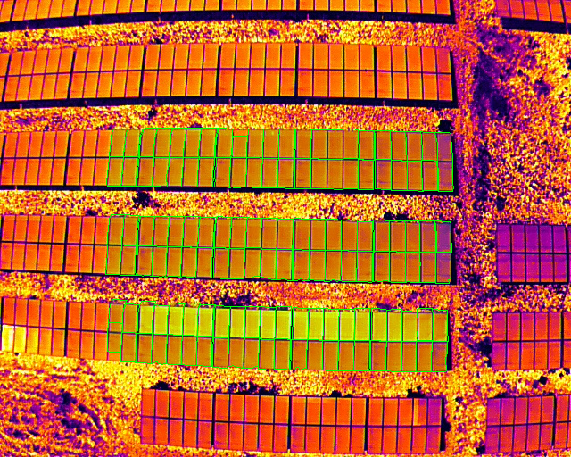
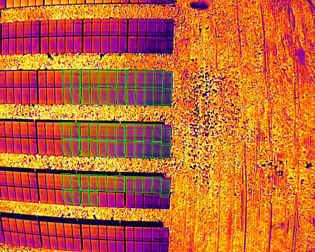

# AI-assisted Thermal Anomaly Annotation 🌡️⚡


Automated identification, classification, and geo-annotation of thermal anomalies in solar PV plants using DJI thermal imagery and YOLOv8.

**Key capabilities:**
- Extracts thermal imagery from DJI drones using the native SDK.
- Detects anomalies such as `Multi_Cell`, `Cell`, `Module_Offline`, `String_Offline`, `Bypass_Diode`, `Vegetation`, etc.
- Overlays detections as bounding boxes onto the source imagery.
- Automatically generates GIS-friendly `.geojson`/shapefiles for importing into mapping software.

---

## 📸 Demo

Here are some examples of the automated anomaly bounding-box overlays on standard solar cell thermal imagery:

<div align="center">
  
  
</div>

> *Note: These images represent the output of `overlay_shapes.py` or the model inference step, showing classified thermal anomalies outlined over the raw RGB/Thermal image.*

---

## 🛠 Features

- **DJI SDK Integration** (`dji_thermal.py`): Extract radiometric and temperature data directly from DJI Zenmuse/Mavic Enterprise thermal images.
- **YOLOv8 Classification Model** (`yolo_train.py`, `detect_anomalies.py`): Train and inference pipeline for specific thermal anomaly classes.
- **Data Extractor Pipeline** (`extract_dataset.py`, `extractor.py`): Preprocess sets manually or automatically.
- **Geospatial Reporting** (`overlay_shapes.py`): Produce `.geojson`/shapefiles linking the location of detected anomalies to drone GPS metadata.

---

## 🚀 Getting Started

### Prerequisites

- Python 3.11+
- [DJI Thermal SDK v1.8+](https://developer.dji.com/thermal-sdk/) *(included in `dji_thermal_sdk_v1.8_20250829/`)*

### Installation

1. **Clone the repository:**

   ```bash
   git clone https://github.com/yourusername/ai-assisted-thermal-annotation.git
   cd ai-assisted-thermal-annotation
   ```

2. **Create and activate a virtual environment:**

   **Linux / macOS**
   ```bash
   python3 -m venv .venv
   source .venv/bin/activate
   ```

   **Windows (Command Prompt)**
   ```cmd
   python -m venv .venv
   .venv\Scripts\activate.bat
   ```

   **Windows (PowerShell)**
   ```powershell
   python -m venv .venv
   .venv\Scripts\Activate.ps1
   ```
   > If PowerShell blocks the script, run once: `Set-ExecutionPolicy -Scope CurrentUser RemoteSigned`

3. **Install all dependencies:**

   ```bash
   pip install -r requirements.txt
   ```

---

### Running the Annotation Tool

**Linux / macOS**
```bash
python -m annotation_tool
```

**Windows**
```cmd
python -m annotation_tool
```

Or with [uv](https://github.com/astral-sh/uv) (no manual venv needed — works on both platforms):
```bash
uv run annotation_tool/main.py
```

---

### Building a Standalone Executable

The build is cross-platform — run these commands on the **target OS** (build on Windows to get a `.exe`, build on Linux to get a Linux binary).

**Step 1 — install build dependencies:**
```bash
pip install -r requirements-build.txt
```

**Step 2 — build:**
```bash
python build_exe.py
```

The bundled app is written to `dist/ThermalAnnotationTool/`.

**Step 3 — run the built executable:**

**Linux / macOS**
```bash
./dist/ThermalAnnotationTool/ThermalAnnotationTool
```

**Windows**
```cmd
dist\ThermalAnnotationTool\ThermalAnnotationTool.exe
```

> **Windows note:** The DJI Thermal SDK Windows DLLs are already included in `dji_thermal_sdk_v1.8_20250829/tsdk-core/lib/windows/release_x64/` and are bundled automatically during the build.

---

## 📂 Project Structure

- `dji_thermal.py`: Helper scripts interacting directly with the DJI Thermal SDK.
- `extract_dataset.py` / `extractor.py`: Tools for organizing and preparing thermal images into specific classification sets.
- `detect_anomalies.py`: YOLOv8 inference script to run the model against target images and log results.
- `yolo_train.py`: Training script for the YOLOv8 classification models.
- `overlay_shapes.py`: Overlays predicted bounded shapes on raw thermal/RGB maps and produces `.geojson` artifacts.

---

## 📊 Training the Model

If you have a customized dataset structured in `yolo_dataset_split/`, run:
```bash
python yolo_train.py
```
This script leverages `yolov8n-cls.pt` (or `yolo26n.pt`) as a base layer and outputs your tuned weights to `runs/classify/thermal_anomaly_clf/weights/best.pt`.

---

## 🤝 Contributing

Contributions, issues, and feature requests are welcome!
Feel free to check [issues page](https://github.com/yourusername/ai-assisted-thermal-annotation/issues).

## 📜 License

This project is licensed under the MIT License - see the LICENSE file for details.

---
*Created for automated solar O&M thermal analysis.*